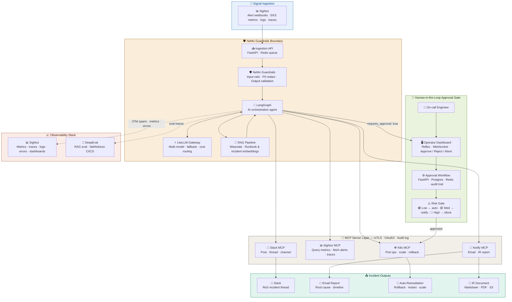

# AI DevOps Incident Response System

An autonomous AI-powered incident response platform for AWS EKS. Ingests alerts from SigNoz, reasons over context using LangGraph, executes remediations via MCP tools, and keeps engineers in the loop through a real-time Reflex approval dashboard — built entirely on open-source tooling.

---

## Architecture Overview

---

## Tech Stack

| Layer | Technology | Purpose |
|---|---|---|
| **Signal Ingestion** | SigNoz | Single source — EKS metrics, logs, traces, errors, alert webhooks |
| **Ingestion API** | FastAPI + Redis | Receives SigNoz webhooks, queues alerts for processing |
| **Guardrails** | NVIDIA NeMo Guardrails | Input safety, PII redaction, output validation, hallucination filtering |
| **AI Agent** | LangGraph | Stateful AI orchestration and incident decision-making |
| **LLM Gateway** | LiteLLM | Multi-model routing, fallback, and cost management |
| **Vector Store** | Weaviate | Runbook and past incident embeddings for RAG |
| **MCP Transport** | mTLS + OAuth2 | Secure tool invocation with signed manifests and full audit log |
| **K8s Actions** | K8s MCP | Pod ops, scaling, rollback on AWS EKS |
| **Metrics Queries** | SigNoz MCP | Query live metrics, fetch firing alerts, pull traces |
| **Notifications** | Slack MCP | Post incident threads, update channels |
| **Reporting** | Notify MCP | Send emails, generate IR reports |
| **Operator Dashboard** | Reflex + WebSocket | Real-time bidirectional incident UI — pure Python, multi-engineer |
| **Approval Workflow** | FastAPI + Postgres + Redis | Approval state machine, timeout escalation, full audit trail |
| **Observability** | SigNoz | Metrics, traces, logs, errors — single unified open-source platform |
| **LLM Eval** | DeepEval | RAG faithfulness and retrieval quality gating in CI/CD |
| **IR Artifacts** | Markdown + PDF + S3 | Archived incident reports with root cause and timeline |

---

## Key Design Decisions

| Decision | Choice | Reasoning |
|---|---|---|
| Observability | **SigNoz** | Replaces Prometheus + Grafana + Tempo + Sentry in one open-source tool |
| LLM Gateway | **LiteLLM** | Single open-source gateway, no PortKey overlap |
| Vector Store | **Weaviate** | Purpose-built vector DB, dropped pgvector overlap |
| Agent Framework | **LangGraph** | Single framework, dropped CrewAI overlap |
| Signal Source | **SigNoz only** | Covers K8s Events, metrics, logs, errors — no separate sources needed |
| On-call Paging | **None** | Operator Dashboard + Slack replaces PagerDuty entirely |
| Frontend | **Reflex** | Pure Python, native WebSocket support, multi-user real-time state |
| Real-time Protocol | **WebSocket** | Bidirectional — engineers can approve, abort, and modify live remediations |

---

## How It Works

### 1. Signal Ingestion
SigNoz monitors the entire AWS EKS cluster via an OpenTelemetry Collector deployed as a DaemonSet. It captures pod crashes, OOM kills, node pressure, app errors, latency spikes, and custom metrics — all in one place. When an alert threshold is breached, SigNoz fires a webhook to the FastAPI ingestion API, which queues it in Redis for processing.

### 2. NeMo Guardrails Boundary
Every alert passes through NVIDIA NeMo Guardrails before reaching the AI agent. This layer enforces input safety rails, strips PII from logs and payloads, validates LLM outputs, and filters hallucinations — ensuring the agent only acts on clean, safe context.

### 3. LangGraph AI Agent
LangGraph drives the core orchestration as a stateful graph. The agent:
- Queries **Weaviate** for relevant runbooks and similar past incidents (RAG)
- Routes LLM calls through **LiteLLM** for model flexibility and cost control
- Decides which MCP tools to invoke based on incident context
- Classifies risk level and flags high-risk actions for human approval

### 4. MCP Server Layer
All tool calls execute through MCP servers secured with mTLS, OAuth2, and signed manifests. Every invocation is written to an audit log. Available tools:

- **K8s MCP** — list pods, get logs, restart, scale, rollback on EKS
- **SigNoz MCP** — query live metrics, fetch firing alerts, pull distributed traces
- **Slack MCP** — post incident threads, update channels, notify team
- **Notify MCP** — send email reports, generate IR documents

### 5. Human-in-the-Loop Approval Gate
The Risk Gate classifies every proposed action:

- 🟢 **Low risk** — executed automatically, no human needed
- 🟡 **Medium risk** — engineer notified via Slack, can review and approve
- 🔴 **High risk** — blocked until explicit approval via the Operator Dashboard

The **Reflex dashboard** maintains a persistent **WebSocket** connection to the FastAPI backend. This means:
- New incidents appear instantly on every connected engineer's screen
- Live remediation status streams in real time — step by step
- Multiple engineers see the exact same state simultaneously
- Any engineer can **abort a running remediation mid-execution** and the backend reacts instantly
- Approval countdown timer is synced across all connected engineers

The approval workflow uses Postgres for state persistence and Redis for timeout management. Unanswered approvals auto-escalate.

### 6. Why Reflex over Streamlit
Streamlit uses WebSockets internally but does not expose them — the only way to get live updates from an external FastAPI backend in Streamlit is polling via `st.rerun()`, which is hacky and slow. Reflex is also pure Python but gives you native WebSocket support, proper multi-user real-time state, and the ability to abort live operations instantly. Still far simpler than Next.js, zero JavaScript required.

### 7. Observability
SigNoz receives OpenTelemetry spans from every LangGraph step and MCP tool call, giving full end-to-end visibility into agent decisions and tool executions — all in one UI. DeepEval gates RAG retrieval quality in CI/CD pipelines.

### 8. Incident Outputs
Every resolved incident produces:
- **Slack thread** — rich incident summary with timeline
- **Email report** — root cause, actions taken, MTTD/MTTR
- **Auto-remediation** — rollback, restart, scale, or cordon on EKS
- **IR document** — Markdown + PDF archived to S3 for post-mortems

---

