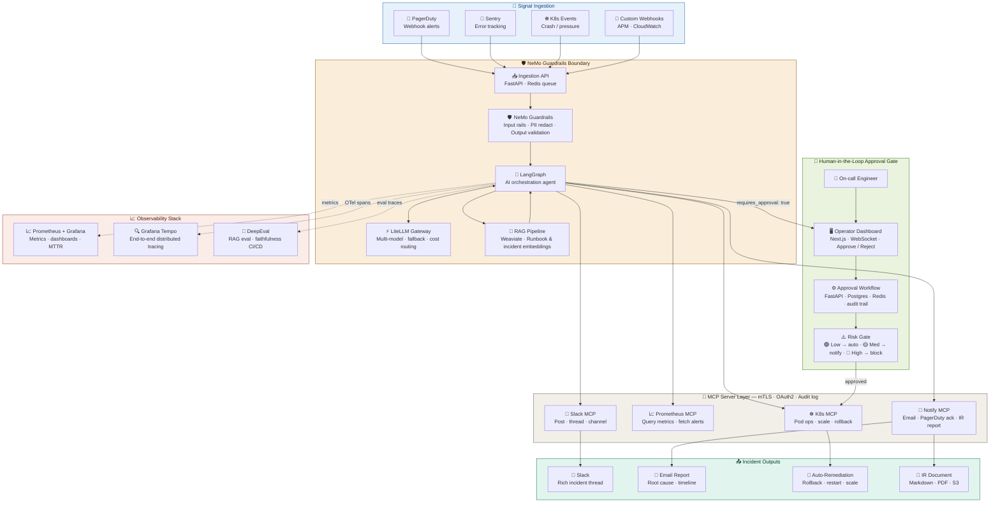

# AI DevOps Incident Response System

An autonomous AI-powered incident response platform that ingests alerts, reasons over context, executes remediations, and keeps humans in the loop — all built on open-source tooling.

---

## Architecture Overview

---

## Tech Stack

| Layer | Technology | Purpose |
|---|---|---|
| **Ingestion** | FastAPI + Redis | Alert queue and ingestion API |
| **Guardrails** | NVIDIA NeMo Guardrails | Input/output safety, PII redaction, hallucination filtering |
| **AI Agent** | LangGraph | Stateful AI orchestration and decision-making |
| **LLM Gateway** | LiteLLM | Multi-model routing, fallback, and cost management |
| **Vector Store** | Weaviate | Runbook and past incident embeddings for RAG |
| **MCP Transport** | mTLS + OAuth2 | Secure tool invocation with signed manifests and audit log |
| **Kubernetes** | K8s MCP | Pod ops, scaling, rollback, log retrieval |
| **Metrics** | Prometheus + Grafana | Infrastructure and app metrics, MTTR/MTTD dashboards |
| **Tracing** | Grafana Tempo | End-to-end distributed tracing via OpenTelemetry |
| **RAG Eval** | DeepEval | Faithfulness and retrieval quality gating in CI/CD |
| **Dashboard** | Next.js + WebSocket | Real-time operator UI for approvals and incident review |
| **Workflow** | FastAPI + Postgres + Redis | Approval state machine with timeout escalation and audit trail |
| **Notifications** | Slack, Email, PagerDuty | Incident communication and acknowledgement |
| **IR Artifacts** | Markdown + PDF + S3 | Archived incident reports with root cause and timeline |

---

## How It Works

### 1. Signal Ingestion
Alerts arrive from PagerDuty webhooks, Sentry error tracking, Kubernetes events (crashes, OOM, evictions), and custom APM/CloudWatch webhooks. All signals are queued via a FastAPI ingestion endpoint backed by Redis.

### 2. NeMo Guardrails Boundary
Every alert passes through NVIDIA NeMo Guardrails before reaching the AI agent. This layer enforces input safety rails, strips PII, validates LLM outputs, and filters hallucinations — ensuring the agent only acts on clean, safe context.

### 3. LangGraph AI Agent
LangGraph drives the core orchestration as a stateful graph. The agent:
- Queries **Weaviate** for relevant runbooks and similar past incidents (RAG)
- Routes LLM calls through **LiteLLM** for model flexibility and cost control
- Decides which MCP tools to invoke based on incident context
- Flags high-risk actions for human approval

### 4. MCP Server Layer
All tool calls are executed through MCP servers secured with mTLS, OAuth2, and signed manifests. Every invocation is written to an audit log. Available tools:
- **K8s MCP** — list pods, get logs, restart, scale, rollback
- **Prometheus MCP** — query metrics, fetch firing alerts
- **Slack MCP** — post incident threads, update channels
- **Notify MCP** — send emails, acknowledge PagerDuty, generate IR reports

### 5. Human-in-the-Loop Approval Gate
The Risk Gate classifies every proposed action:
- 🟢 **Low risk** — executed automatically
- 🟡 **Medium risk** — on-call engineer notified, can approve or modify
- 🔴 **High risk** — blocked until explicit approval via the Operator Dashboard

The Operator Dashboard (Next.js + WebSocket) presents the incident card, evidence, and proposed actions in real time. The approval workflow uses Postgres for state persistence and Redis for timeouts, with full audit trail. Unanswered approvals auto-escalate.

### 6. Observability
- **Prometheus + Grafana** — metrics, dashboards, MTTD/MTTR tracking
- **Grafana Tempo** — OpenTelemetry spans from every LangGraph step and MCP tool call
- **DeepEval** — RAG faithfulness and retrieval quality evaluated in CI/CD pipelines

### 7. Incident Outputs
Resolved incidents produce:
- Slack thread with rich Block Kit formatting
- Email report with root cause, timeline, MTTD/MTTR
- Auto-remediation actions (rollback, restart, scale, cordon)
- Archived IR document (Markdown + PDF) stored in S3

---
